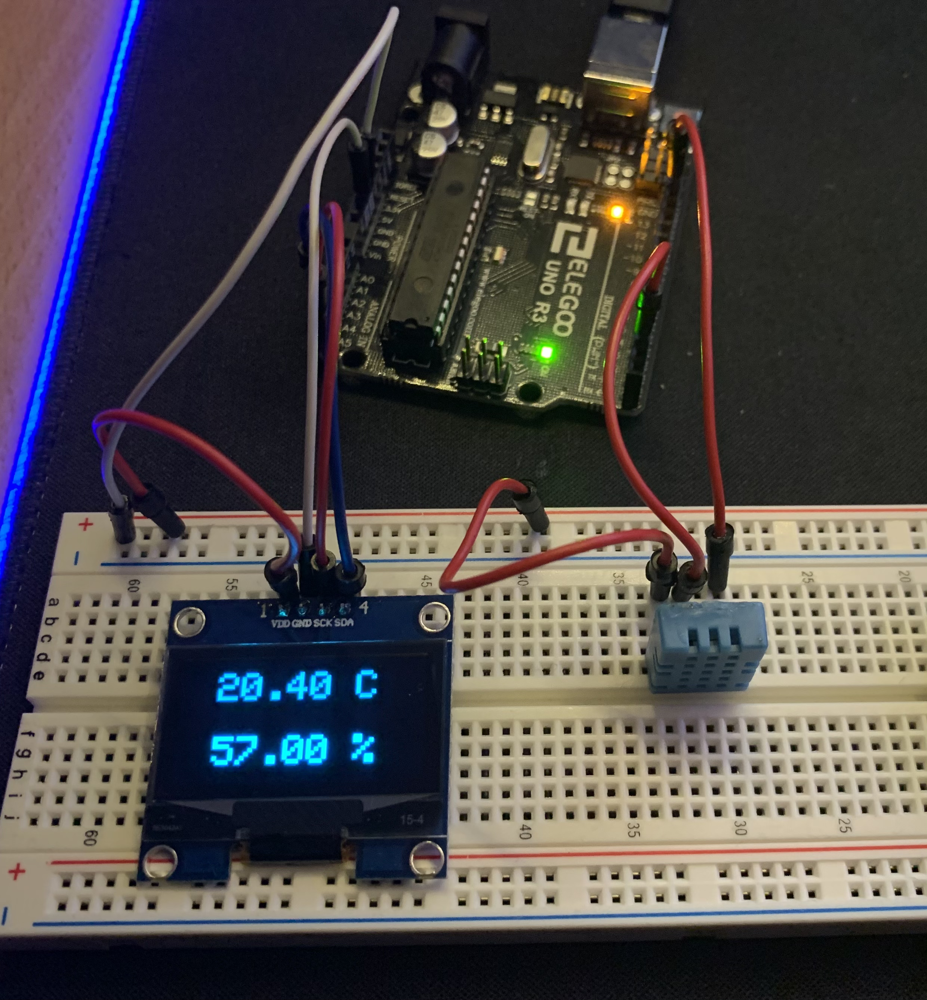

# arduino-1.3-oled-temp
 

this code and libray's are for a 1.3 inch oled display and DHT11/22 temperature sensor 

NOTE!: you need to download the GFX library in the arduino IDE!

ENJOY YOUR PROJECT
